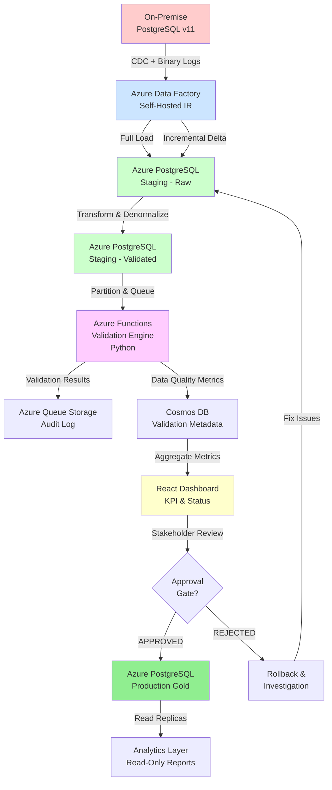
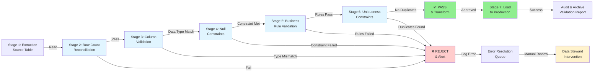
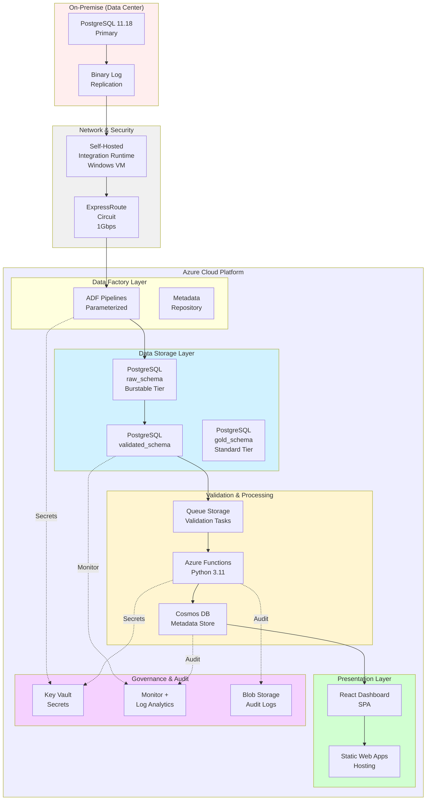
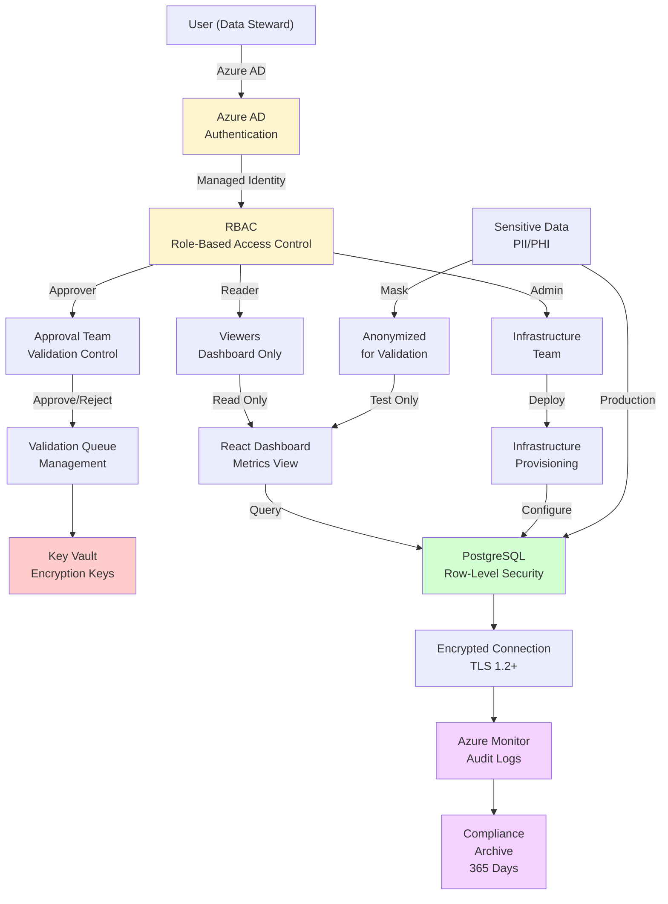
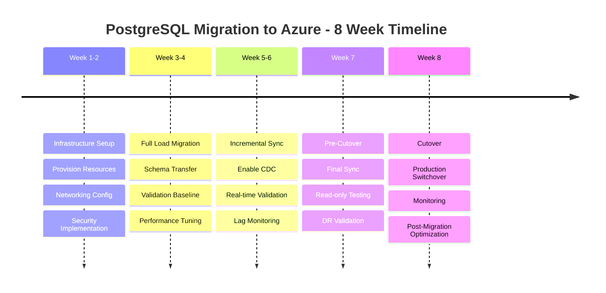
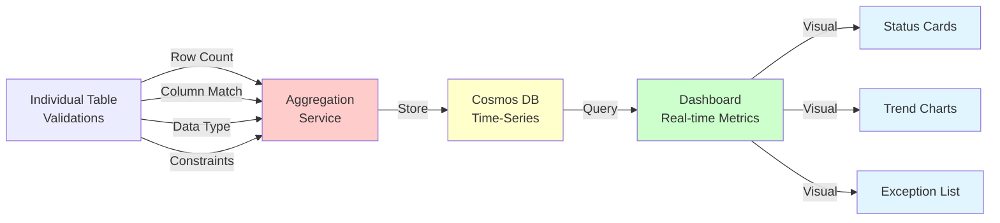

# Architecture Diagrams

## End-to-End Migration Flow

## Data Validation Workflow

## Component Architecture (Detailed)

## Security & Compliance Architecture

## Deployment Timeline & Phases

## Validation Result Aggregation

---

**Legend:**
- 🟥 Red: Error/Rejection state
- 🟩 Green: Success/Approved state
- 🟨 Yellow: Manual intervention required
- 🟦 Blue: Information/Metadata layer
